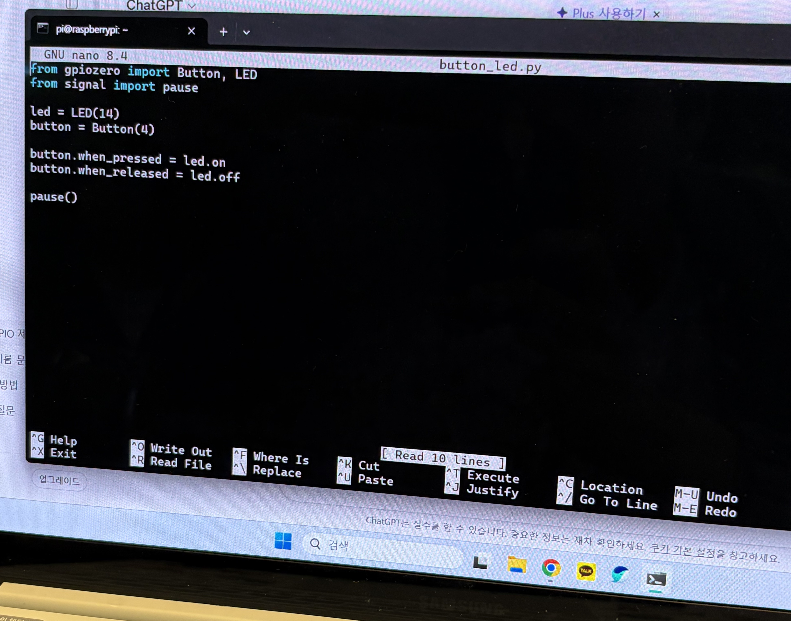
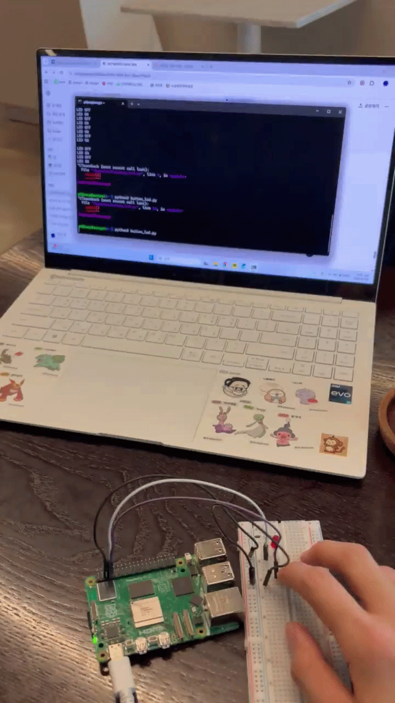

# 🔘 Read Digital Inputs with Python (Buttons and Other Peripherals)

## 1️⃣ 회로 조립

- 참고 사이트를 보고 버튼과 LED 회로를 동일하게 구성하였다.

---

## 2️⃣ Python 파일 생성

```bash
nano button_led.py
```

---

## 3️⃣ 코드 작성

```python
from gpiozero import Button, LED
from signal import pause

led = LED(14)
button = Button(4)

button.when_pressed = led.on
button.when_released = led.off

pause()
```

---

### 📷 nano 편집기에서 코드를 저장한 모습



---

## 4️⃣ 실행

```bash
python3 button_led.py
```

---

### 🎞️ 버튼 입력 실행 GIF


